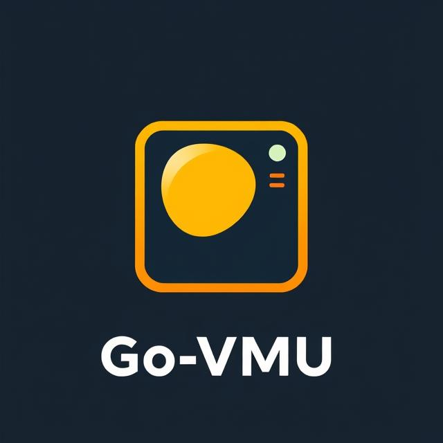

# Go-VMU
### Video Metadata Updater

<div align="center">
  
</div>

<div align="center">
  <a href="https://github.com/bmj2728/go-vmu"></a>
  <a href="https://github.com/bmj2728/go-vmu/issues"></a>
  <a href="https://github.com/bmj2728/go-vmu/blob/main/LICENSE"></a>
  <a href="https://hub.docker.com/r/bmj2728/go-vmu"></a>
  <a href="https://github.com/bmj2728/go-vmu/pkgs/container/go-vmu"></a>
</div>

## What Is It?

The Go Video Metadata Updater (Go-VMU) is designed to parse metadata from Jellyfin-created NFO files and update video files with that metadata. This tool helps maintain consistent metadata across your media library by extracting information from NFO files and embedding it directly into the video files. With significant stability improvements, Go-VMU now provides reliable metadata updating for both local and network-mounted file systems.

## How It Works

The application follows a simple workflow:

1. Parses the NFO (XML) file associated with a video file
2. Extracts the metadata (title, plot, actors, etc.)
3. Updates the video files using FFmpeg while preserving the original video and audio quality
4. Validates the updated file to ensure no corruption occurred

## Current Status

### Working Features
- Local batch processing of files
- Support for NFS/network-mounted file systems
- Command-line interface with Cobra CLI
- Concurrent processing with worker pools
- Real-time progress tracking
- Logging with configurable verbosity

### Performance Notes
- Local file processing offers very fast speeds
- NFS/network processing is fully supported but may be slower with larger files

## Requirements

- Go 1.24 or higher
- FFmpeg and FFprobe installed and available in your PATH
- Jellyfin-compatible NFO files (Recommended to use Jellyfin automated nfo creation)

## Installation

```bash
# Clone the repository
git clone https://github.com/bmj2728/go-vmu.git
cd go-vmu

# Build the application
go build -o vmu ./cmd/vmu

# Install the binary (optional)
sudo cp vmu /usr/local/bin/
sudo chmod +x /usr/local/bin/vmu
```

## Usage

The application features a command-line interface for easy usage:

```bash
# Basic usage
vmu /path/to/your/media/library

# Specify number of worker threads
vmu /path/to/your/media/library --workers 4

# Enable verbose logging
vmu /path/to/your/media/library --verbose

# Combine options
vmu /path/to/your/media/library --workers 4 --verbose
```

You can also use shorthand forms of options

```bash
# --workers can be shortened to -w 
# --verbose shortened to -v
vmu /path/to/your/media/library -w 4 -v
```

The application will:
1. Scan your media library recursively for video files
2. Process files concurrently using a worker pool
3. Display real-time progress with file names and processing stages
4. Update each file with metadata from its corresponding NFO file
5. Provide a summary of results upon completion

### Future Enhancements

- Support for different NFO formats
- Enhanced error recovery for file operations
- Additional metadata customization options

## Sample Output

After processing, FFprobe will show the embedded metadata tags in your video files:

### Before
```json
{
  "tags": {
    "encoder": "libebml v1.3.5 + libmatroska v1.4.8",
    "creation_time": "2020-03-04T08:14:33.000000Z",
    "Writing frontend": "StaxRip v1.7.0.6"
  }
}
```

### After
```json
{
  "tags": {
    "title": "The Original",
    "EPISODE": "1",
    "ACTOR": "Evan Rachel Wood, Thandiwe Newton, Jeffrey Wright, Tessa Thompson, James Marsden, Angela Sarafyan, Anthony Hopkins, Ingrid Bolsø Berdal, Ed Harris, Shannon Woodward, Sidse Babett Knudsen, Jimmi Simpson, Ben Barnes, Simon Quarterman, Luke Hemsworth, Louis Herthum, Eddie Rouse, Kyle Bornheimer, Bridgid Coulter, Regi Davis, Mataeo Mingo, Trevante Rhodes, Micky Shiloah, Keller Wortham, Olivia May, Alex Marshall-Brown, Jeffrey Muller, Brook Kerr, Bradley Snedeker, Patrick Quinlan, David Coatsworth, Roberto Patino",
    "TVDB_ID": "5626064",
    "DIRECTOR": "Jonathan Nolan",
    "WRITING_FRONTEND": "StaxRip v1.7.0.6",
    "PLOT": "As another day of fantasy plays out in Westworld — a vast, remote park where guests pay top dollar to share wild-west adventures with android \"hosts\" — top programmer Bernard Lowe alerts park founder Dr. Robert Ford about incidents of aberrant behavior cropping up in some recently re-coded hosts. Meanwhile, in the Westworld town of Sweetwater, a rancher's daughter named Dolores encounters a gunslinger named Teddy in the street — but their predictable narrative is upended by the appearance of a ruthless Man in Black and, later, by a supporting host's unscripted encounter with an artifact of the outside world.",
    "CREDITS": "Lisa Joy",
    "GENRE": "Drama, Mystery, Sci-Fi",
    "YEAR": "2016",
    "WRITER": "Lisa Joy",
    "SHOWTITLE": "Westworld",
    "SEASON": "1",
    "RUNTIME": "68",
    "IMDB_ID": "tt4227538",
    "ENCODER": "Lavf61.7.100"
  }
}
```

## Docker

You can run Go-VMU using Docker, which eliminates the need to install Go, FFmpeg, and FFprobe on your host system. Prebuilt Docker images are available on both GitHub Container Registry and Docker Hub.

### Using Prebuilt Docker Images

Go-VMU is available as a prebuilt Docker image from:
- GitHub Container Registry: `ghcr.io/bmj2728/go-vmu:latest`
- Docker Hub: `bmj2728/go-vmu:latest`

```bash
# Pull from GitHub Container Registry
docker pull ghcr.io/bmj2728/go-vmu:latest

# OR pull from Docker Hub
docker pull bmj2728/go-vmu:latest
```

### Building the Docker Image Locally

If you prefer to build the image yourself:

```bash
# Clone the repository
git clone https://github.com/bmj2728/go-vmu.git
cd go-vmu

# Build the Docker image
docker build -t go-vmu .
```

### Running with Docker

```bash
# Basic usage with proper user permissions (IMPORTANT)
# Using GitHub Container Registry
docker run -v /path/to/your/media/library:/videos -e PUID=$(id -u) -e PGID=$(id -g) ghcr.io/bmj2728/go-vmu:latest /videos

# OR using Docker Hub
docker run -v /path/to/your/media/library:/videos -e PUID=$(id -u) -e PGID=$(id -g) bmj2728/go-vmu:latest /videos

# Specify number of worker threads
docker run -v /path/to/your/media/library:/videos -e PUID=$(id -u) -e PGID=$(id -g) ghcr.io/bmj2728/go-vmu:latest /videos --workers 4

# Enable verbose logging
docker run -v /path/to/your/media/library:/videos -e PUID=$(id -u) -e PGID=$(id -g) ghcr.io/bmj2728/go-vmu:latest /videos --verbose

# Combine options
docker run -v /path/to/your/media/library:/videos -e PUID=$(id -u) -e PGID=$(id -g) ghcr.io/bmj2728/go-vmu:latest /videos --workers 4 --verbose
```

### Important Note on Permissions

It is **critical** to match the PUID and PGID to the owner of your media files for proper access. The examples above use the current user's UID and GID, but you should adjust these values to match the actual owner of your media files.

```bash
# Manually enter the PUID and PGID values
# Using GitHub Container Registry
docker run -v /path/to/your/media/library:/videos -e PUID=1001 -e PGID=1001 ghcr.io/bmj2728/go-vmu:latest /videos --workers 4 --verbose

# OR using Docker Hub
docker run -v /path/to/your/media/library:/videos -e PUID=1001 -e PGID=1001 bmj2728/go-vmu:latest /videos --workers 4 --verbose
```

The Docker container:
1. Includes the Go-VMU binary and required FFmpeg/FFprobe binaries
2. Runs as a non-root user for improved security
3. Mounts your media directory to `/videos` inside the container
4. Processes your files with the same functionality as the native application

## Technical Limitations

- Currently only supports Jellyfin NFO format
- The application creates temporary files during processing which require additional disk space
- Error handling for individual file processing failures is implemented, but the application will continue processing other files

## Expected File Organization

Go-VMU expects your media files to be organized with sidecar NFO files in the same directory as the video files. Here's an example of the expected organization pattern:

```
└── 3 Body Problem
    ├── Season 1
    │   ├── 3 Body Problem - S01E01 - Countdown WEBRip-1080p Proper.mkv
    │   ├── 3 Body Problem - S01E01 - Countdown WEBRip-1080p Proper.nfo
    │   ├── 3 Body Problem - S01E02 - Red Coast WEBRip-1080p Proper.mkv
    │   ├── 3 Body Problem - S01E02 - Red Coast WEBRip-1080p Proper.nfo
    │   ├── 3 Body Problem - S01E03 - Destroyer of Worlds WEBRip-1080p Proper.mkv
    │   ├── 3 Body Problem - S01E03 - Destroyer of Worlds WEBRip-1080p Proper.nfo
    │   ├── 3 Body Problem - S01E04 - Our Lord WEBRip-1080p Proper.mkv
    │   ├── 3 Body Problem - S01E04 - Our Lord WEBRip-1080p Proper.nfo
    │   ├── 3 Body Problem - S01E05 - Judgment Day WEBRip-1080p Proper.mkv
    │   ├── 3 Body Problem - S01E05 - Judgment Day WEBRip-1080p Proper.nfo
    │   ├── 3 Body Problem - S01E06 - The Stars Our Destination WEBRip-1080p Proper.mkv
    │   ├── 3 Body Problem - S01E06 - The Stars Our Destination WEBRip-1080p Proper.nfo
    │   ├── 3 Body Problem - S01E07 - Only Advance WEBRip-1080p Proper.mkv
    │   ├── 3 Body Problem - S01E07 - Only Advance WEBRip-1080p Proper.nfo
    │   ├── 3 Body Problem - S01E08 - Wallfacer WEBRip-1080p Proper.mkv
    │   ├── 3 Body Problem - S01E08 - Wallfacer WEBRip-1080p Proper.nfo
```

The application will automatically match each video file with its corresponding NFO file based on the filename.

## Acknowledgements

Go-VMU would not be possible without these amazing open-source projects:

- [FFmpeg](https://ffmpeg.org/) - The powerful multimedia framework used for video processing
- [Jellyfin](https://jellyfin.org/) - The free software media system that creates the NFO files
- [Cobra](https://github.com/spf13/cobra) - The CLI framework that powers our command-line interface
